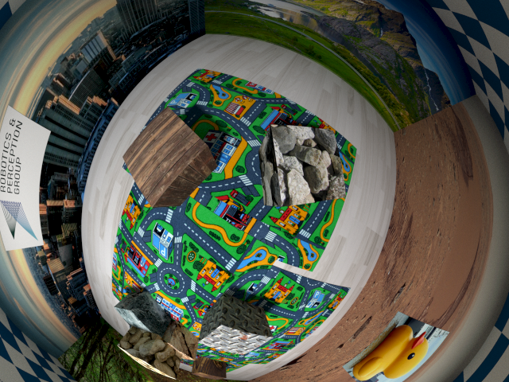
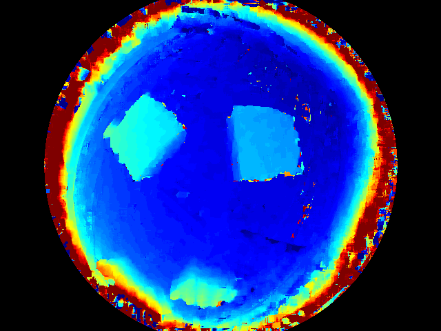
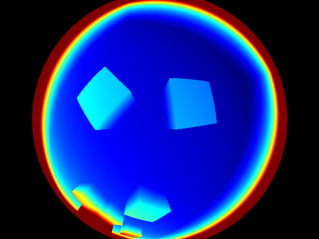

# OCamStereo
***OcamStereo*** is an implementation for plane sweep stereo [1] with the omni camera model [2].
OcamStereo is full GPU implementation based on the PSL-Python.

## Result of plane sweep motion stereo


## Requirements
***OcamStereo*** requires the following libraries:
+ cupy
+ opencv
+ nose (only for testing)
+ open3d (only for visualization)

## Usage
```sh
python Python/OCamStereo/main.py
```

## References
[1] Häne, C., Heng, L., Lee, G. H., Sizov, A., & Pollefeys, M. (2014, December). Real-time direct dense matching on fisheye images using plane-sweeping stereo. In 2014 2nd International Conference on 3D Vision (Vol. 1, pp. 57-64). IEEE.

[2] Zhang, Z., Rebecq, H., Forster, C., & Scaramuzza, D. (2016, May). Benefit of large field-of-view cameras for visual odometry. In 2016 IEEE International Conference on Robotics and Automation (ICRA) (pp. 801-808). IEEE.
