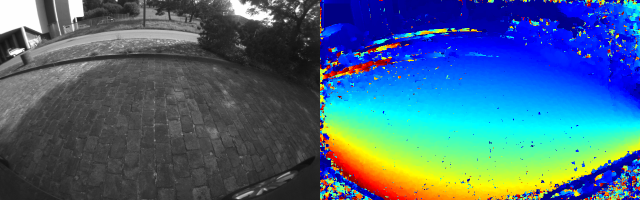

# PSL-Python
***PSL-Python*** is a Python implementation of plane sweep stereo [1] for fisheye images with the unified camera model [2].
The matching costs (SAD, ZSAD, NCC and ZNCC) are computed on the CPU with NumPy or on the GPU with CuPy.

[OCamStereo](./Python/OCamStereo/README.md) is a full GPU implementation with the omni camera model based on PSL-Python.

## Result of plane sweep motion stereo
The grayscale reference image (left) and the depth map computed with ZNCC from 5 consecutive images (right).



## Requirements
***PSL-Python*** requires an NVIDIA GPU with a CUDA driver and conda (Miniconda / Anaconda).
The following libraries are installed from conda by [Python/environment_min.yaml](./Python/environment_min.yaml):
+ cupy
+ opencv
+ open3d (only for visualization of OCamStereo)
+ pytest (only for testing)
```sh
conda env create -f Python/environment_min.yaml
conda activate psl-20260926
```

## Usage
```sh
cd Python
python psl_main.py
```

## References
[1] Häne, C., Heng, L., Lee, G. H., Sizov, A., & Pollefeys, M. (2014, December). Real-time direct dense matching on fisheye images using plane-sweeping stereo. In 2014 2nd International Conference on 3D Vision (Vol. 1, pp. 57-64). IEEE.

[2] Mei, C., & Rives, P. (2007, April). Single view point omnidirectional camera calibration from planar grids. In Proceedings 2007 IEEE International Conference on Robotics and Automation (pp. 3945-3950). IEEE.
